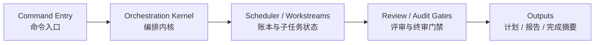

# iLongRun

> 把 GitHub Copilot CLI 从“只会单次规划”升级成**可长跑、可恢复、可审计**的任务编排内核。

iLongRun 适合希望把复杂任务交给 AI 持续推进的人：它不只是发一个 prompt，而是会把任务拆成阶段、波次、workstream，并把关键状态写进账本，方便你中途查看、恢复和复盘。

---

## 1. iLongRun 是什么

你可以把 iLongRun 理解成一层“任务操作系统”：

- 负责把大任务拆成阶段和子任务
- 负责记录任务当前做到哪一步
- 负责在 coding 场景下增加 review / audit / finalize 门禁
- 负责在中断后继续上一次运行，而不是从头再来

它的账本真值是：

```text
scheduler.json + workstreams/*/status.json
```

其中：

- `scheduler.json` 的 **top-level `state`** 是 run 主状态的唯一真值
- 新 run 只允许 `running / blocked / completed / failed` 四种 canonical state
- top-level `status` 已被废弃；新 run 一旦出现 `scheduler.status`，verify / doctor 会直接判定为硬失败
- 从 `v0.9.0` 开始不再兼容旧 run 账本；历史 run 只适合作为人工复盘样本

Markdown 文件（`mission.md`、`strategy.md`、`plan.md`、`task-list-N.md`）主要是给人看的投影，不是最终真值。

## 2. 适合谁 / 不适合谁

### 适合谁

- 想让 AI 持续推进一个复杂任务，而不是只回答一轮
- 需要“中途暂停，之后恢复继续”的开发者
- 需要 review / audit / completion evidence 的 coding 任务
- 想把任务过程留痕，便于排查和复盘的人

### 不太适合谁

- 只想临时问一句话、一次性拿答案的人
- 不需要账本、恢复、审计链路的小任务
- 完全不想看状态文件或运行目录的人

## 3. 核心价值

- **能恢复**：终端关掉后还能接着跑
- **能追踪**：知道当前 phase / wave / workstream 在哪里
- **能审计**：coding 任务有 review、audit、finalize gate
- **能复盘**：有结构化证据，不靠“我记得跑过”
- **能控模型**：传 `--model` 时，整条执行链都会锁定到同一个模型

## 4. 安装前准备

建议先确认：

- 已安装 GitHub Copilot CLI
- 已完成 `copilot login`
- 终端里能正常找到 `python3`
- macOS 用户如果想要系统提醒，可额外准备 `terminal-notifier`（没有也能回退）

## 5. 一键安装

```bash
curl -fsSL https://raw.githubusercontent.com/izscc/iLongRun/main/install.sh | bash
```

安装完成后，建议立刻做一次体检：

```bash
command -v ilongrun
command -v ilongrun-coding
command -v ilongrun-model
ilongrun-doctor --refresh-model-cache
ilongrun-doctor --notify-test
```

## 6. 第一次怎么用

### 最短体验路径

```bash
ilongrun-doctor --refresh-model-cache
ilongrun "帮我梳理这个项目的 README 并给出修改建议"
ilongrun-status latest
```

### 如果你要做 coding 任务

```bash
ilongrun-coding "实现一个 TypeScript 模块，补测试，并完成 review gate"
ilongrun-status latest
ilongrun-resume latest
```

### 如果你想强制指定模型

```bash
ilongrun-coding --model claude-haiku-4.5 "修一个小 bug，并补测试"
```

从当前版本开始，`--model` 不只是“入口优先模型”，而是：

> **run / coding / review / audit / finalize 全链路都锁定到你指定的模型。**

也就是说，如果你传的是 `claude-haiku-4.5`，内部不会再静默切去别的更强模型。

### 如果你想热切换后续新任务的默认主模型

```bash
ilongrun-model
ilongrun-model show
ilongrun-model --refresh
ilongrun-model claude-haiku-4.5
ilongrun-model reset
```

这条命令的语义是：

- 在 **TTY 终端**里直接运行 `ilongrun-model`，会进入带 Tab 页签的交互式选模器
- 在 **非 TTY** 场景里直接运行 `ilongrun-model`，会退化为 `show`
- `show` 现在会输出与 `ilongrun` 体系一致的品牌化中文看板；如果要脚本化消费，请使用 `--json`
- `--refresh` 会先刷新模型缓存，再进入选模器或 show
- 交互式 TUI 顶部有 3 个页签：
  - `全局默认`：同时更新 `ilongrun` 与 `ilongrun-coding`
  - `run模型`：只更新 `ilongrun`
  - `coding模型`：只更新 `ilongrun-coding`
- 在交互式 TUI 里可以用 `Tab` / `Shift+Tab` / 左右方向键切页；`r` 会弹确认并执行**全局 reset**
- **只有交互式 TUI 才区分上述作用域**
- 直接运行 `ilongrun-model <slug>` 仍是**全局模式**
- 只影响**后续新启动**的 `ilongrun` / `ilongrun-coding`
- 不会回写当前正在跑的 run
- `resume` 仍优先继承目标 run 既有的 `selectedModel`
- review roles / final audit 仍保持独立审查模板（默认 `gpt-5.4`）
- 不会改变你当前 Copilot CLI 会话里的原生 `/model` 选择

### Copilot 会话里有哪些 `/ilongrun*` 入口？

当前会话菜单里保留这些中文说明的入口：

- `/ilongrun`
- `/ilongrun-prompt`
- `/ilongrun-resume`
- `/ilongrun-status`

注意：

- `ilongrun-model` 现在是**终端裸命令**
- 不再作为 Copilot 会话内的 `/ilongrun-model` skill 暴露

## 7. 常用命令

| 命令 | 作用 |
|---|---|
| `ilongrun "<任务>"` | 通用长跑入口，自动判断任务画像 |
| `ilongrun-coding "<任务>"` | coding 专用入口，固定走 coding 生命周期 |
| `ilongrun-model [show\|<model>\|reset] [--refresh]` | 在终端里交互式 / 脚本化查看与切换后续新任务的默认主模型模板；TTY 交互界面支持 `全局默认 / run模型 / coding模型` Tab 页签 |
| `ilongrun-prompt "<任务>"` | 只生成策略骨架，不进入完整长跑 |
| `ilongrun-status latest` | 查看最近一次 run 的中文状态看板 |
| `ilongrun-resume latest` | 继续上一次 run |
| `ilongrun-doctor` | 检查安装、登录、模型、bundle 完整性，并体检当前工作区 active/latest run 健康 |
| `copilot-ilongrun ...` | 高级入口，适合脚本化或手动控制参数 |

## 8. 会生成哪些文件

每次运行都会在当前工作区生成：

```text
.copilot-ilongrun/
```

你最常看到的是这些：

- `mission.md`：任务目标和边界说明
- `strategy.md`：总体策略
- `plan.md`：阶段和波次规划
- `scheduler.json`：主账本真值
- `task-list-N.md`：按阶段展开的人类可读清单
- `workstreams/ws-*/status.json`：每个子任务的真实状态
- `reviews/final-review.md`：最终终审报告
- `reviews/adjudication.md`：裁决报告
- `COMPLETION.md`：仅 `completed` run 生成
- `BLOCKED.md`：仅 `blocked` run 生成
- `FAILED.md`：仅 `failed` run 生成

## 9. 架构图（简化版）



如果你想看更详细的 coding 生命周期图，请直接看：[`docs/架构与运行机制.md`](./docs/架构与运行机制.md)

## 10. 常见问题

### Q1：`ilongrun` 和 `ilongrun-coding` 有什么区别？

- `ilongrun`：通用入口，自动判断任务类型
- `ilongrun-coding`：明确告诉系统“这是编码任务”，因此会启用更严格的 define / plan / build / verify / review / audit / finalize 生命周期

### Q2：运行中断了怎么办？

直接执行：

```bash
ilongrun-resume latest
```

### Q3：我怎么知道它有没有真的完成？

先看 `scheduler.json.state`，再看与之匹配的终态摘要：

- `completed` → `.copilot-ilongrun/runs/<run-id>/COMPLETION.md`
- `blocked` → `.copilot-ilongrun/runs/<run-id>/BLOCKED.md`
- `failed` → `.copilot-ilongrun/runs/<run-id>/FAILED.md`

coding 任务还要关注：

- `reviews/final-review.md`
- `reviews/adjudication.md`

补充：

- 只有 `state=completed` + `COMPLETION.md` 存在 + `active-run-id` 已清理，才算真正闭环完成
- `state=blocked` 时必须看 `BLOCKED.md`，它表示 run 已阻断结束，不是成功完成
- `state=failed` 时必须看 `FAILED.md`，它表示 run 已失败结束
- `ilongrun-doctor` 会把终态摘要缺失、终态文档错配、active 指针残留等问题直接显示在“当前工作区 Run 健康”区块

### Q4：`--model` 到底控制到什么程度？

如果你显式传了 `--model <slug>`：

- 主执行链路用这个模型
- review gate 用这个模型
- final audit 用这个模型
- finalize 前后续衔接仍保持这个模型
- 不会跨模型 fallback 到别的 slug

### Q5：`ilongrun-model` 和 `--model` 有什么区别？

- `ilongrun-model`：改的是**默认模板**，影响后续新任务
- `--model`：改的是**本次 run 的显式锁定模型**

换句话说：

- 想长期把默认主模型切到别的 slug，用 `ilongrun-model`
- 想只让当前这一次 run 强制锁模，用 `--model`

补充一点：

- `ilongrun-model` 不会改你当前 Copilot CLI 会话的原生 `/model`
- 它只改 iLongRun 的默认模板配置
- `ilongrun-model <model>` 是**全局模式**
- 如果你想只改 `run` 或只改 `coding`，请在 `ilongrun-model` 的交互式 TUI 中切到对应页签后再选模型

### Q6：`/fleet` 一定会用吗？

不会。

`/fleet` 只是某些 wave 的执行后端，不是默认必走。尤其在 coding 场景下，只有 `phase-build` 才可能评估 `/fleet`，review / audit / finalize 一律 internal。

## 11. 进阶阅读

- [快速开始](./docs/快速开始.md)
- [架构与运行机制](./docs/架构与运行机制.md)
- [项目全局审计与整改说明](./docs/项目全局审计与整改说明.md)
- [真实样本复盘：test5-game](./docs/真实样本复盘-test5-game.md)
- [发版说明 v0.8.4](./docs/发版说明-v0.8.4.md)
- [更新日志](./CHANGELOG.md)
