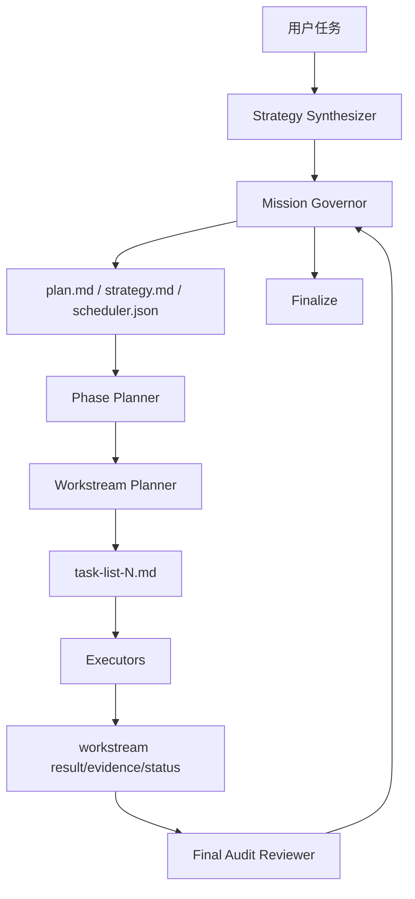

# iLongRun

> 让 GitHub Copilot CLI 从“单层 plan”升级为真正可恢复、可裁决、可长跑的 **Planner-of-Planners 蜂群编排内核**。

开发者：**zscc.in / 知识船仓**

---

## iLongRun 是什么

iLongRun 是一个面向 **GitHub Copilot CLI** 的独立插件项目，核心目标是把复杂任务从：

- 只有一个顶层 `plan.md`
- 很快结束的轻任务
- 主代理吞掉所有执行

升级为：

- `scheduler.json` 五层真值模型
- `plan.md + task-list-N.md + workstreams/*` 多层任务链
- `Mission Governor + Planner-of-Planners + Executor + Recovery + Final Audit` 分层角色体系
- `/fleet` 波次级并行执行
- coding 任务的 **最终终审 + adjudication 裁决**
- **完整编码纪律**：TDD、增量实现、系统化调试、五轴代码审查、安全加固、性能优化

如果你想要的是：

- 更强的长跑能力
- 更科学的任务拆解
- 更完整的交付闭环
- 不是模板，而是根据任务动态生成策略

那么 `iLongRun` 就是为这个目标设计的。

---

## 和 LongRun 的关系

- **LongRun**：原始项目，偏轻量长跑内核
- **iLongRun**：独立新项目，专注 **Swarm Kernel / Planner-of-Planners**

这不是在旧仓库里附带的一个小功能，而是一个**完全独立的新项目**。

---

## 一键安装（推荐）

```bash
curl -fsSL https://raw.githubusercontent.com/izscc/iLongRun/main/install.sh | bash
```

安装完成后建议先检查：

```bash
command -v ilongrun
command -v ilongrun-coding
ilongrun-doctor --refresh-model-cache
ilongrun-doctor --notify-test
```

> 如果你是首批安装 v0.3.0 的用户，重新执行一次一键安装即可补齐 `ilongrun-coding` 入口。
> 第二条用于 **macOS 通知链路自检**。如果没有看到提醒横幅，请检查系统通知权限、专注模式和通知摘要。
> 从当前 v0.4.0 更新版开始，一键安装会先执行**彻底清理**：卸载旧 `ilongrun / longrun / copilot-mission-control` 插件定义、清空旧缓存/命令/skills/agents/`~/.copilot-ilongrun` 与 `~/.copilot-mission-control`，然后再安装新版插件与 launchers。
> 这意味着一键安装会重置旧的本地 iLongRun 状态与配置；如果你想保留自定义 `~/.copilot-ilongrun/config/model-policy.jsonc`，请先自行备份。
> 如果本机 `copilot plugin install` 可用，安装脚本会尝试注册新版插件；如果插件注册失败，也不会影响本地 skills + launchers 的使用。

安装结束后，终端会直接展示一张 **中文安装看板**，把安装状态、新手下一步、环境摘要和常用命令一次讲清楚。
看板里还会明确告诉你默认模型配置文件位置：`~/.copilot-ilongrun/config/model-policy.jsonc`，以及 `commandDefaults / skillDefaults / codingAuditModel` 分别该改哪里。

---

## 30 秒快速上手

### 1）直接启动长跑

```bash
ilongrun "修复登录流程并补充测试，最后完成最终终审"
```

### 2）先只看策略骨架

```bash
ilongrun-prompt "调研 3 个 AI Agent 编排方案，并输出中文对比结论"
```

### 3）显式启动 coding 长跑

```bash
ilongrun-coding "设计并实现一个 TypeScript 服务端模块，补测试并在最后完成终审"
```

### 4）查看状态

```bash
ilongrun-status latest
```

> 默认输出中文状态看板，必要时仅在中文后补充原始机器值。

### 5）继续上一次长跑

```bash
ilongrun-resume latest
```

---

## 核心命令

```bash
ilongrun
ilongrun-coding
ilongrun-prompt
ilongrun-resume
ilongrun-status
ilongrun-doctor
copilot-ilongrun
```

其中：

- `ilongrun`：推荐通用入口，会按任务内容自动推断 profile
- `ilongrun-coding`：显式 coding 入口，直接强制 `profile=coding`
- `copilot-ilongrun`：兼容 / 高级入口
- `ilongrun-doctor`：环境、自检、launcher 完整性、模型、旧插件冲突治理、`/fleet` 能力探测、macOS 通知自检

---

## 默认模型与配置文件

从 v0.4.0 开始，iLongRun 的默认模型**统一由配置文件控制**，不再散落硬编码。

用户主配置路径：

```bash
~/.copilot-ilongrun/config/model-policy.jsonc
```

仓库默认模板：

```bash
./config/model-policy.jsonc
```

### 默认命令 → 模型映射

| 命令 | 默认模型 |
|------|----------|
| `ilongrun` / `copilot-ilongrun run` | `claude-sonnet-4.6` |
| `ilongrun-status` / `copilot-ilongrun status` | `claude-sonnet-4.6` |
| `ilongrun-prompt` / `copilot-ilongrun prompt` | `claude-sonnet-4.6` |
| `ilongrun-resume` / `copilot-ilongrun resume` | `claude-sonnet-4.6` |
| `ilongrun-doctor` / `copilot-ilongrun doctor` | `claude-sonnet-4.6` |
| `ilongrun-coding` / `copilot-ilongrun coding` | `claude-opus-4.6` |
| coding 最终终审 | `gpt-5.4` |

### 选模优先级

1. 显式 `--model`
2. `commandDefaults`
3. `skillDefaults`
4. `roleModels`
5. `fallback`

### 你可以怎么改

直接编辑 `model-policy.jsonc` 里的这些字段：

- `commandDefaults`：控制命令默认模型
- `skillDefaults`：控制 skill 默认模型
- `roleModels`：控制内部角色建议模型
- `codingAuditModel`：控制 coding 最终终审模型
- `fallback`：控制统一回退链

### 可复制的模型 slug 与建议

> 配置文件注释区已经附带一份可直接复制的模型 ID 建议表。
> 其中会区分：
> - **本机已通过 doctor/probe 验证**
> - **GitHub Copilot 官方支持，但建议先验证**

常用 slug：

- `claude-sonnet-4.6`：通用长跑 / 状态 / prompt
- `claude-opus-4.6`：编码实现 / 复杂改造
- `claude-opus-4.5`：高能力兜底
- `claude-sonnet-4.5`：通用兜底
- `gpt-5.4`：最终终审 / 高严谨审查
- `claude-haiku-4.5`：轻量、低成本场景
- `gpt-5-mini`：成本优先、简单整理

### 通知会消耗 Copilot AI 次数吗？

不会。`--notify-test` 和最终系统通知都只走本地 `notify_macos.py + terminal-notifier/osascript`。

真正会消耗 Copilot 请求的是 run / resume / audit / recovery 这些 Copilot 会话。

---

## iLongRun 的 5 种模式

### 1. Direct Lane
适合单目标、单主链路、无需并行的任务。

### 2. Wave Swarm
适合有明确依赖图的多阶段任务，例如：调研 → 整合 → 验证。

### 3. Super Swarm
适合 3 个以上彼此独立的 workstream，可并行推进。

### 4. Fleet Governor
适合复杂、长跑、强恢复、强复盘任务；这是 iLongRun 的默认高级模式。

### 5. Sentinel Watch
适合持续观察、轮询、等待外部条件变化的任务。

---

## 为什么 coding 任务要有最终终审

iLongRun 默认采用配置驱动的模型编排：

- 通用长跑 / 状态 / prompt / resume：**Claude Sonnet 4.6**
- coding 实现：**Claude Opus 4.6**
- coding 最终终审：**`codingAuditModel`（默认 GPT-5.4）**

对于 coding mission：

1. 先完成主任务执行
2. 再生成 `reviews/gpt54-final-review.md`
3. 再由主代理生成 `reviews/adjudication.md`
4. 若存在 `must-fix`，则阻塞 finalize，必须返工

这一步是 iLongRun 的质量底线，不是可选装饰。

---

## `/fleet` 什么时候会启用

iLongRun 不会盲目使用 `/fleet`。

只有满足以下条件时，某个 wave 才会被调度到 `/fleet`：

- 2 到 4 个独立子任务
- 共享写集为空或已显式分区
- 不依赖中途人工裁决
- 失败后可独立重试

如果本机 Copilot CLI 不支持 `/fleet`，或者 wave 执行回填不稳定，iLongRun 会自动降级回 `internal`，并把原因写进状态账本与策略投影。

---

## 运行目录结构

每次运行会在当前工作区生成：

```text
.copilot-ilongrun/
└── runs/<run-id>/
    ├── mission.md
    ├── strategy.md
    ├── plan.md
    ├── scheduler.json
    ├── task-list-1.md
    ├── task-list-2.md
    ├── reviews/
    │   ├── gpt54-final-review.md
    │   └── adjudication.md
    └── workstreams/
        └── ws-001/
            ├── brief.md
            ├── status.json
            ├── result.md
            └── evidence.md
```

### 真值与投影

- 真值：`scheduler.json` + `workstreams/*/status.json`
- 投影：`plan.md`、`strategy.md`、`task-list-N.md`

也就是说：**Markdown 给人看，JSON 给系统做账。**

### v0.4.0 的目录治理规则

- 工作区只允许一个 iLongRun 根目录：`.copilot-ilongrun/`
- 所有 run 只允许放在 `.copilot-ilongrun/runs/<run-id>/`
- 旧的 `.copilot-ilongrun/<run-id>/` 会在 reconcile / verify / finalize 时自动收敛
- 如果检测到旧 `copilot-mission-control` 插件仍启用，`install` / `doctor` / `launch` 会自动尝试卸载并清理工作区残留
- 若工作区存在 `.copilot-mission-control/`，会被归档到 `.copilot-ilongrun/legacy-imports/` 后移除

### detached 启动看板

从 v0.4.0 开始，`ilongrun` / `ilongrun-coding` / `ilongrun-resume` 的 detached 启动输出会统一成品牌化中文看板，默认采用 **iLongRun 金黄色主题、右侧开口框、TTY 下品牌渐变标题**，展示：

- run id
- 当前状态 / 当前阶段 / 运行模式
- 任务画像
- 执行模型 / 最终终审模型
- 工作区 / log / meta 路径
- `ilongrun-status <run-id>` / `ilongrun-resume <run-id>` 快捷命令
- 下一步建议

---

## 编码纪律体系（v0.2.0 新增）

当任务为 `profile=coding` 时，iLongRun 会自动加载编码纪律技能，指导 executor 按照科学的编码流程执行。

- `ilongrun-coding`：给终端用户直接用的 shell 命令入口
- `skills/ilongrun-coding/SKILL.md`：内部自动加载的 discipline skill，不是主要用户入口

也就是说：**用户从命令行敲 `ilongrun-coding`，系统内部再自动加载 `ilongrun-coding` skill 纪律。**

### 六阶段编码生命周期

```
DEFINE → PLAN → BUILD → VERIFY → REVIEW → SHIP
```

### 七大编码纪律

| 纪律 | 核心原则 |
|------|----------|
| **TDD** | Red-Green-Refactor，先测试后实现 |
| **增量实现** | 薄垂直切片，每步可工作、可回滚 |
| **系统化调试** | Stop-the-Line + 五步排查法 |
| **代码审查** | 五轴审查（正确性/可读性/架构/安全/性能） |
| **安全加固** | 三层边界 + OWASP Top 10 |
| **性能优化** | 先测量后优化 + Core Web Vitals |
| **Git 工作流** | 原子提交 + 描述性消息 |

详见 `skills/ilongrun-coding/SKILL.md` 和 `references/` 目录。

---

## 执行逻辑图



---

## 常见问题

### Q1：它现在是 Copilot CLI 插件吗？
是。仓库里包含 `plugin.json`、`skills/`、`agents/`、`hooks.json`，同时也提供本地安装脚本，方便不依赖插件缓存直接用。

### Q2：只装插件就够了吗？
不一定。为了保证全局命令、helper bundle 和本地状态目录可用，推荐直接执行一键安装命令。

### Q3：为什么工作区里会同时出现 `.copilot-ilongrun` 和 `.copilot-mission-control`？
这通常说明旧 `copilot-mission-control` 插件仍然处于 enabled，Copilot hooks 同时在写两套目录。

从 v0.4.0 开始：

- `install.sh` 会先尝试自动卸载旧插件
- `ilongrun-doctor` 会检测并再次自动修复
- 当前工作区里的 `.copilot-mission-control/` 会被归档后移除

如果你想手动处理，也可以直接执行：

```bash
copilot plugin uninstall copilot-mission-control
ilongrun-doctor
```

### Q4：`/fleet` 探测失败是不是不能用？
不是。只是对应 wave 不会走 `/fleet`，会自动降级为 `internal`，核心长跑仍可继续。

### Q5：为什么会同时看到 `plan.md` 和多个 `task-list-N.md`？
因为 `plan.md` 负责顶层编排，`task-list-N.md` 负责具体执行清单，这是 iLongRun 的设计目标之一。

---

## 文档

- [快速开始](./docs/快速开始.md)
- [架构与运行机制](./docs/架构与运行机制.md)
- [发版说明 v0.4.0](./docs/发版说明-v0.4.0.md)
- [发版说明 v0.3.0](./docs/发版说明-v0.3.0.md)
- [发版说明 v0.2.1](./docs/发版说明-v0.2.1.md)
- [发版说明 v0.2.0](./docs/发版说明-v0.2.0.md)
- [发版说明 v0.1.0](./docs/发版说明-v0.1.0.md)
- [更新日志](./CHANGELOG.md)

---

## 许可

MIT
