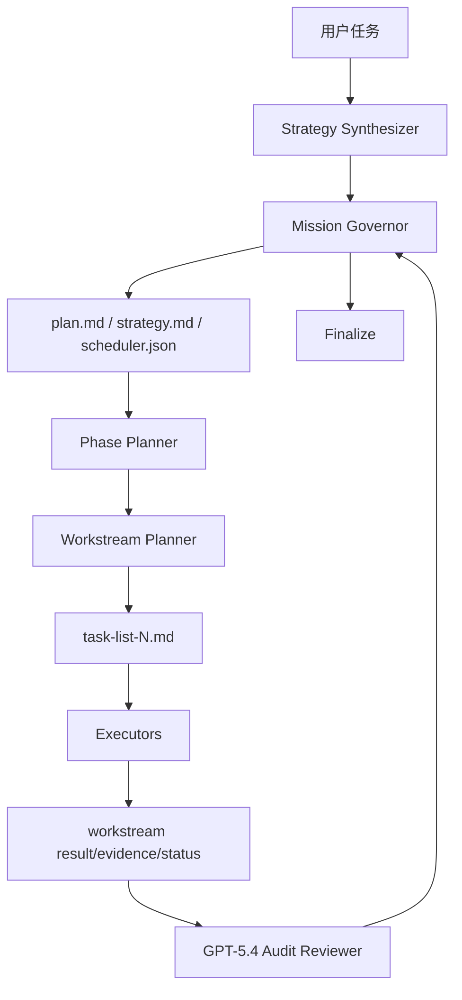

# iLongRun

> 让 GitHub Copilot CLI 从“单层 plan”升级为真正可恢复、可裁决、可长跑的 **Planner-of-Planners 蜂群编排内核**。

开发者：**zscc.in / 知识船仓**

---

## iLongRun 是什么

iLongRun 是一个面向 **GitHub Copilot CLI** 的独立插件项目，核心目标是把复杂任务从：

- 只有一个顶层 `plan.md`
- 很快结束的轻任务
- 主代理吞掉所有执行

升级为：

- `scheduler.json` 五层真值模型
- `plan.md + task-list-N.md + workstreams/*` 多层任务链
- `Mission Governor + Planner-of-Planners + Executor + Recovery + GPT-5.4 Audit` 分层角色体系
- `/fleet` 波次级并行执行
- coding 任务的 **GPT-5.4 强制终审 + adjudication 裁决**

如果你想要的是：

- 更强的长跑能力
- 更科学的任务拆解
- 更完整的交付闭环
- 不是模板，而是根据任务动态生成策略

那么 `iLongRun` 就是为这个目标设计的。

---

## 和 LongRun 的关系

- **LongRun**：原始项目，偏轻量长跑内核
- **iLongRun**：独立新项目，专注 **Swarm Kernel / Planner-of-Planners**

这不是在旧仓库里附带的一个小功能，而是一个**完全独立的新项目**。

---

## 一键安装（推荐）

```bash
curl -fsSL https://raw.githubusercontent.com/izscc/iLongRun/main/install.sh | bash
```

安装完成后建议先检查：

```bash
ilongrun-doctor --refresh-model-cache
```

> 如果本机 `copilot plugin install` 可用，安装脚本会尝试顺手注册插件；如果插件注册失败，也不会影响本地 skills + launchers 的使用。

---

## 30 秒快速上手

### 1）直接启动长跑

```bash
ilongrun "修复登录流程并补充测试，最后做 GPT-5.4 终审"
```

### 2）先只看策略骨架

```bash
ilongrun-prompt "调研 3 个 AI Agent 编排方案，并输出中文对比结论"
```

### 3）查看状态

```bash
ilongrun-status latest
```

### 4）继续上一次长跑

```bash
ilongrun-resume latest
```

---

## 核心命令

```bash
ilongrun
ilongrun-prompt
ilongrun-resume
ilongrun-status
ilongrun-doctor
copilot-ilongrun
```

其中：

- `ilongrun`：推荐主入口
- `copilot-ilongrun`：兼容 / 高级入口
- `ilongrun-doctor`：环境、自检、模型、`/fleet` 能力探测

---

## iLongRun 的 5 种模式

### 1. Direct Lane
适合单目标、单主链路、无需并行的任务。

### 2. Wave Swarm
适合有明确依赖图的多阶段任务，例如：调研 → 整合 → 验证。

### 3. Super Swarm
适合 3 个以上彼此独立的 workstream，可并行推进。

### 4. Fleet Governor
适合复杂、长跑、强恢复、强复盘任务；这是 iLongRun 的默认高级模式。

### 5. Sentinel Watch
适合持续观察、轮询、等待外部条件变化的任务。

---

## 为什么 coding 任务要强制 GPT-5.4 终审

iLongRun 默认采用能力优先的模型编排：

- 主编排 / 常规执行：**Claude Opus 4.6**
- 复杂逻辑、代码审计、最终终审：**GPT-5.4**

对于 coding mission：

1. 先完成主任务执行
2. 再生成 `reviews/gpt54-final-review.md`
3. 再由主代理生成 `reviews/adjudication.md`
4. 若存在 `must-fix`，则阻塞 finalize，必须返工

这一步是 iLongRun 的质量底线，不是可选装饰。

---

## `/fleet` 什么时候会启用

iLongRun 不会盲目使用 `/fleet`。

只有满足以下条件时，某个 wave 才会被调度到 `/fleet`：

- 2 到 4 个独立子任务
- 共享写集为空或已显式分区
- 不依赖中途人工裁决
- 失败后可独立重试

如果本机 Copilot CLI 不支持 `/fleet`，或者 wave 执行回填不稳定，iLongRun 会自动降级回 `internal`，并把原因写进状态账本与策略投影。

---

## 运行目录结构

每次运行会在当前工作区生成：

```text
.copilot-ilongrun/
└── runs/<run-id>/
    ├── mission.md
    ├── strategy.md
    ├── plan.md
    ├── scheduler.json
    ├── task-list-1.md
    ├── task-list-2.md
    ├── reviews/
    │   ├── gpt54-final-review.md
    │   └── adjudication.md
    └── workstreams/
        └── ws-001/
            ├── brief.md
            ├── status.json
            ├── result.md
            └── evidence.md
```

### 真值与投影

- 真值：`scheduler.json` + `workstreams/*/status.json`
- 投影：`plan.md`、`strategy.md`、`task-list-N.md`

也就是说：**Markdown 给人看，JSON 给系统做账。**

---

## 执行逻辑图



---

## 常见问题

### Q1：它现在是 Copilot CLI 插件吗？
是。仓库里包含 `plugin.json`、`skills/`、`agents/`、`hooks.json`，同时也提供本地安装脚本，方便不依赖插件缓存直接用。

### Q2：只装插件就够了吗？
不一定。为了保证全局命令、helper bundle 和本地状态目录可用，推荐直接执行一键安装命令。

### Q3：`/fleet` 探测失败是不是不能用？
不是。只是对应 wave 不会走 `/fleet`，会自动降级为 `internal`，核心长跑仍可继续。

### Q4：为什么会同时看到 `plan.md` 和多个 `task-list-N.md`？
因为 `plan.md` 负责顶层编排，`task-list-N.md` 负责具体执行清单，这是 iLongRun 的设计目标之一。

---

## 文档

- [快速开始](./docs/快速开始.md)
- [架构与运行机制](./docs/架构与运行机制.md)
- [发版说明 v0.1.0](./docs/发版说明-v0.1.0.md)
- [更新日志](./CHANGELOG.md)

---

## 许可

MIT
