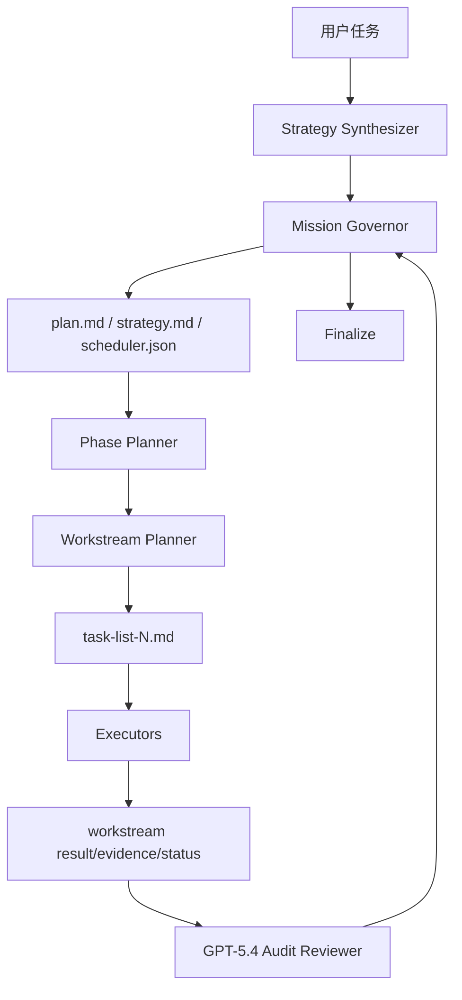

# iLongRun 架构与运行机制

## 1. 核心定位

iLongRun 不是单纯的 prompt 模板，而是围绕 GitHub Copilot CLI 构建的 **Planner-of-Planners 蜂群编排内核**。

## 2. 角色分工

- `Mission Governor`：总编排、裁决、重规划、收尾
- `Strategy Synthesizer`：生成策略与模式选择理由
- `Phase Planner`：拆 phase / wave
- `Workstream Planner`：拆 task-list-N.md
- `Executor`：执行单个 workstream
- `Recovery Agent`：失败恢复与最小路径修正
- `GPT-5.4 Audit Reviewer`：coding 终审

## 3. 真值与投影

- 真值：`scheduler.json` + `workstreams/*/status.json`
- 投影：`plan.md`、`strategy.md`、`task-list-N.md`

也就是说，Markdown 是给人看的，JSON 是系统账本。

## 4. 典型运行链路

## 5. `/fleet` 的位置

`/fleet` 只是 iLongRun 的某个 **wave 执行后端**，不是状态真值源。

当 `/fleet` 可用且当前 wave 满足独立性条件时，supervisor 会外部 dispatch；若探测失败或执行回填不稳定，会自动降级为 `internal`。
