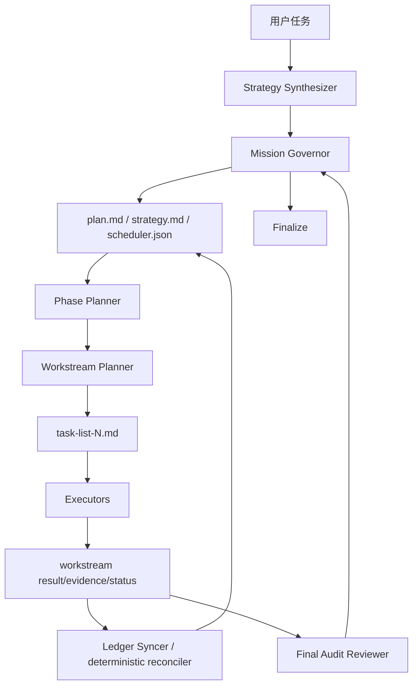

# iLongRun 架构与运行机制

## 1. 核心定位

iLongRun 不是单纯的 prompt 模板，而是围绕 GitHub Copilot CLI 构建的 **Planner-of-Planners 蜂群编排内核**。

## 2. 角色分工

- `Mission Governor`：总编排、裁决、重规划、收尾
- `Strategy Synthesizer`：生成策略与模式选择理由
- `Phase Planner`：拆 phase / wave
- `Workstream Planner`：拆 task-list-N.md
- `Ledger Syncer`：把 scheduler 真值回写到 plan / task-list 投影
- `Executor`：执行单个 workstream
- `Recovery Agent`：失败恢复与最小路径修正
- `Final Audit Reviewer`：coding 终审

## 3. 真值与投影

- 真值：`scheduler.json` + `workstreams/*/status.json`
- 投影：`plan.md`、`strategy.md`、`task-list-N.md`
- 显式索引：`scheduler.taskLists[]`

也就是说，Markdown 是给人看的，JSON 是系统账本。

补充约束：

- 只有执行型 phase 会投影成 `task-list-N.md`
- verify / review / audit / finalize 默认保留在 `plan.md` / `reviews/`
- `task-list` 的勾选状态由结构化 checklist 确定性回写
- 当 workstream 声称完成但 result/evidence/status 不成闭环时，必须标记 `⚠ drift`
- coding verify 会额外生成 `reviews/delivery-audit.md`，扫描未接主链模块 / 重名核心模块 / noop provider
- verify 还会生成 evidence-based completion score，用 `codeExists / wiredIntoEntry / tested / runtimeValidated` 四层分数帮助区分“高产出原型”与“真实交付”
- coding 报告模板统一为固定章节骨架，避免 review / adjudication / completion 因自由发挥而破坏机器可读性

## 4. 典型运行链路



## 5. `/fleet` 的位置

`/fleet` 只是 iLongRun 的某个 **wave 执行后端**，不是状态真值源。

当 `/fleet` 可用且当前 wave 满足独立性条件时，supervisor 会外部 dispatch；若探测失败或执行回填不稳定，会自动降级为 `internal`。

为避免只剩“账面启用”而没有可审计证据，runtime 现在额外保留：

- `runtime.fleetCapability`
  - 探测状态、原因、时间、probe model、缓存位置、来源脚本、输出摘要
- `runtime.fleetDispatch`
  - completed / degraded 波次
  - 最近一次 wave outcome
  - `dispatchEvents[]` 结构化分发证据

verify 会检查这些字段与 phase/wave 真值是否一致，状态看板也会直接展示。

## 6. 账本同步脚本

当历史 run 缺失 `taskLists[]`、`taskListPath`、勾选状态或 `active-run-id` 未清理时，可使用：

```bash
python3 scripts/sync_ilongrun_ledger.py --workspace <workspace> --run-id <run-id> --clean-active-on-complete --print-json
```

它会先基于真值重建投影，再执行 verify，并在需要时清理已完成 run 的 `active-run-id`。

## 7. 状态看板

`ilongrun-status` 现在优先走本地 helper `render_ilongrun_status_board.py`，使用与 install / doctor / launch 相同的终端主题组件。

看板重点展示：

- 当前 run 状态、阶段、模式、模型、画像
- completion score 与 delivery verdict
- phase / wave / workstream 进度
- coding 审查门禁
- verification / drift / risk 摘要
- ledger sync / projection sync / active-run 指针
- fleet runtime 摘要（如适用）

## 8. 统一报告模板

为兼顾可读性与稳定解析，iLongRun 对 coding run 约定以下固定章节：

- Final Review：`Run Metadata → Summary → Findings → Suggested Fixes → Residual Risks → Verdict`
- Adjudication：`Run Metadata → Summary → Findings Intake → Decision → Next Actions → Verdict`
- Completion：`Run Metadata → Summary → Completion Score → Deliverables → Verification Evidence → Blockers → Verdict`

其中：

- `Must-Fix / Should-Fix / Residual Risks` 标题前缀保持稳定，供 verifier 解析
- 空节统一写 `- None.`
- `Verdict` 必须独立成节，避免被误记为 residual risk
