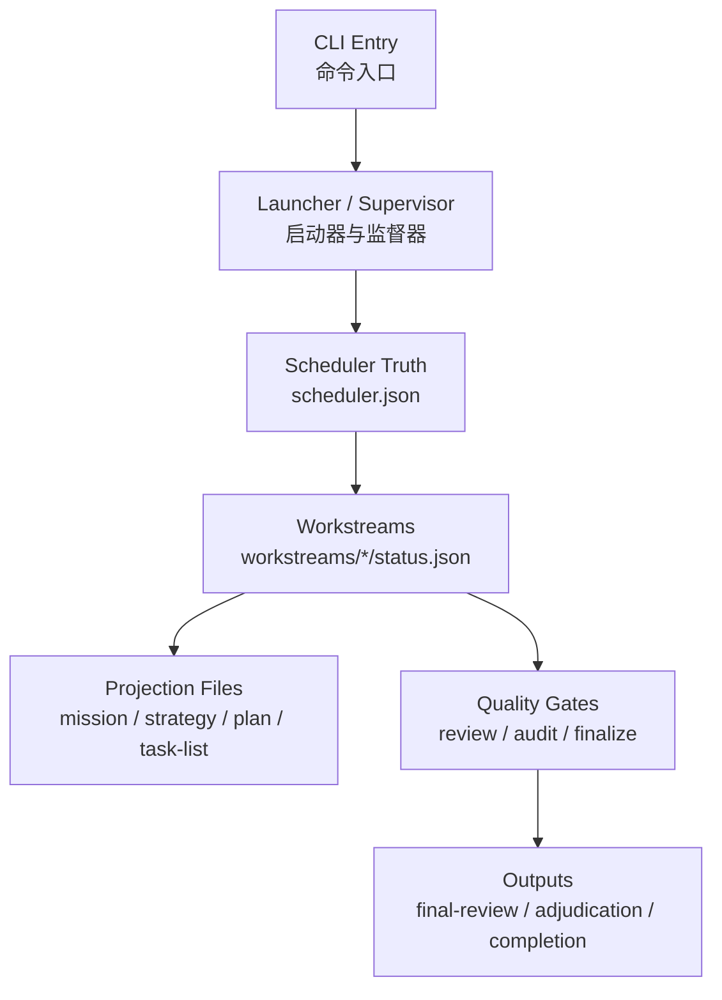
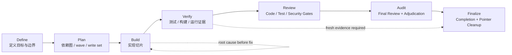

# iLongRun 架构与运行机制

这份文档面向需要理解内部行为的人，重点解释：命令入口、账本真值、coding 生命周期、`/fleet` 边界，以及 `--model` 的全链路强制语义。

## 1. 核心定位

iLongRun 不是 prompt 模板合集，而是围绕 GitHub Copilot CLI 构建的**长运行任务编排内核**。

它负责的不是“替你回答一句话”，而是：

- 拆任务
- 记账本
- 控阶段
- 留证据
- 做 review / audit / finalize 闭环

## 2. 系统总览图



## 3. 真值与投影

### 真值

- `scheduler.json`
- `workstreams/*/status.json`

### 投影

- `mission.md`
- `strategy.md`
- `plan.md`
- `task-list-N.md`
- `workstreams/*/brief.md`
- `reviews/*`

### 原则

- JSON 是系统真值
- Markdown 是人类可读投影
- 投影可以重建，但真值不能随便猜

## 4. coding 生命周期



### 各阶段职责

- `phase-define`：锁目标、边界、成功标准
- `phase-plan`：写 dependency graph、wave、write set、handoff
- `phase-build`：真正实现切片；必要时才评估 `/fleet`
- `phase-verify`：固定测试 / 构建 / 运行证据
- `phase-review`：独立执行 code / test-evidence / security gate
- `phase-audit`：生成 `reviews/final-review.md` 与 `reviews/adjudication.md`
- `phase-finalize`：生成 `COMPLETION.md` 并清理 active pointer

## 5. 方法学硬门禁

### workspace isolation

build 前要先判断是否需要：

- git worktree
- feature branch
- in-place

### task microcycle

build workstream 默认遵循：

```text
spec-lock → red → verify-red → green → verify-green → self-review → spec-review → quality-review → handoff
```

### claim verification

没有 fresh evidence，不能 claim done。

### root cause before fix

failed / blocked workstream 必须先写 `rootCauseRecord`，再允许最小修复。

## 6. `/fleet` 的位置

`/fleet` 只是某些 wave 的执行后端，不是账本真值。

### 使用边界

- 只有满足并行条件时才可用
- coding 任务只允许 `phase-build` 评估 `/fleet`
- review / audit / finalize 永远 internal

### 运行态证据

- `runtime.fleetCapability`
- `runtime.fleetDispatch`

状态看板读取的是这些运行态证据，而不是只看 mode 文案。

## 7. `--model` 的全链路强制语义

当前版本将 `--model` 定义为：

> **用户显式锁定模型后，整条 run 链路都必须沿用该模型。**

覆盖范围：

- launcher / supervisor
- scheduler `selectedModel`
- `codingAuditModel`
- `mission.modelAllocation`
- review workstream `ownerModel`
- final audit model
- 报告中的模型元数据

### 行为约束

- 若用户传 `--model claude-haiku-4.5`，则 audit 不得切到 `gpt-5.4`
- `fallbackChain` 不再混入其他模型
- 允许同模型重试，但不允许跨模型降级

## 8. 关键角色

- `Mission Governor`：总编排、裁决、重规划、收尾
- `Strategy Synthesizer`：策略与边界建模
- `Phase Planner`：phase / wave 设计
- `Workstream Planner`：worker 合同拆解
- `Ledger Syncer`：账本回写与投影同步
- `Executor`：执行子任务
- `Recovery Agent`：恢复与最小修复
- `Code Reviewer`：代码评审
- `Test Engineer`：测试证据评审
- `Security Auditor`：安全评审
- `Final Audit Reviewer`：最终终审

## 9. 报告骨架

### Final Review

- Run Metadata
- Summary
- Findings
- Suggested Fixes
- Residual Risks
- Verdict

### Adjudication

- Run Metadata
- Summary
- Findings Intake
- Decision
- Next Actions
- Verdict

### Completion

- Run Metadata
- Summary
- Completion Score
- Deliverables
- Verification Evidence
- Blockers
- Verdict
