# iLongRun Skills 架构全景图

> 基于当前项目源码实际梳理，分析范围主要是 `ilongrun-repo/skills/*`、`ilongrun-repo/scripts/*`、`ilongrun-repo/agents/*`、`ilongrun-repo/config/*`。

## 1. 范围说明

### 本文重点覆盖的主技能

1. `ilongrun`
2. `ilongrun-coding`
3. `ilongrun-resume`
4. `ilongrun-prompt`
5. `ilongrun-status`

### 一句话结论

- 这个项目本质上不是“几个 prompt”，而是一个 **长运行任务编排内核**。
- 真正的运行真值始终是：`scheduler.json + workstreams/*/status.json`。
- `mission.md / strategy.md / plan.md / task-list-N.md / reviews/* / COMPLETION.md` 都是 **投影层**。
- `ilongrun-coding` 的壳命令虽然独立，但实际外层仍通过 `/ilongrun` 进入，再由 `profile=coding` 自动加载编码纪律内核。
- `ilongrun-status` 是唯一明显 **不依赖 Copilot 执行技能正文** 的主技能，它直接本地渲染状态看板。
- `ilongrun-prompt` 只生成策略骨架，**不创建 run 账本**。

---

## 2. 全局总览

## 2.1 系统运行全景图

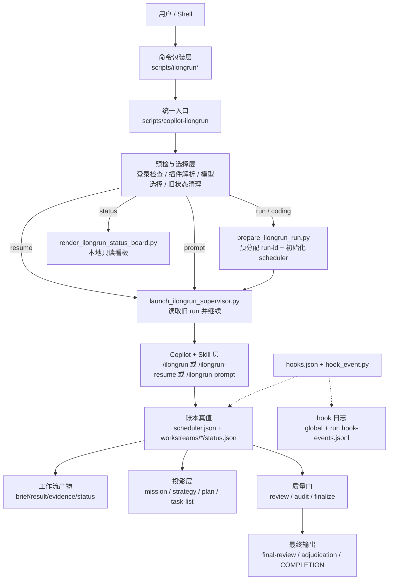

## 2.2 真值层与投影层关系图

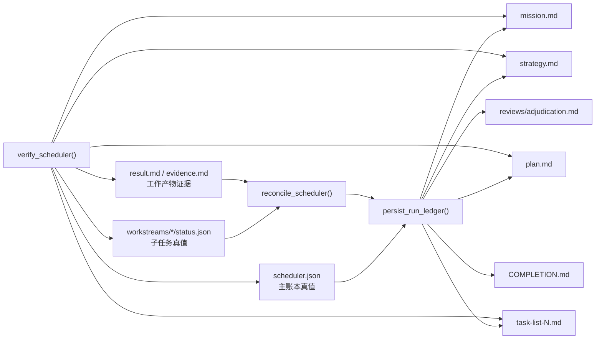

## 2.3 角色分工图

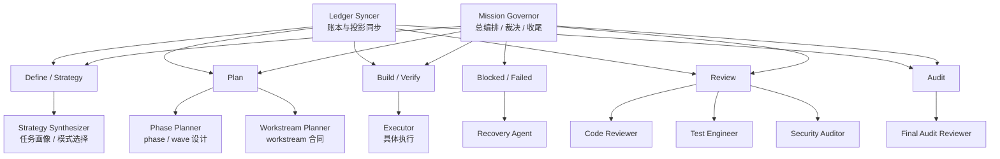

---

## 3. 主技能总表

| Skill | 用户入口 | 是否创建 run | 是否调用 Copilot | 是否写账本 | 核心职责 |
|---|---|---:|---:|---:|---|
| `ilongrun` | `ilongrun "<任务>"` | 是 | 是 | 是 | 通用长跑入口，自动推断 profile / mode / topology |
| `ilongrun-coding` | `ilongrun-coding "<任务>"` | 是 | 是 | 是 | 强制进入 coding profile，并加载编码纪律内核 |
| `ilongrun-resume` | `ilongrun-resume latest` | 否（复用旧 run） | 是 | 是 | 只收敛未完成 gate，不重开整局 |
| `ilongrun-prompt` | `ilongrun-prompt "<任务>"` | 否 | 是 | 否 | 只生成策略骨架与推荐执行方式 |
| `ilongrun-status` | `ilongrun-status latest` | 否 | 否 | 否（只读） | 本地读取 run 真值，渲染中文状态看板 |

---

## 4. 公共运行内核

## 4.1 命令入口层

项目的几个 shell 命令都非常薄，只负责把命令转发给统一入口：

- `scripts/ilongrun` → `copilot-ilongrun run --detach`
- `scripts/ilongrun-coding` → `copilot-ilongrun coding --detach`
- `scripts/ilongrun-resume` → `copilot-ilongrun resume --detach`
- `scripts/ilongrun-prompt` → `copilot-ilongrun prompt`
- `scripts/ilongrun-status` → `copilot-ilongrun status`

也就是说，**真正的运行控制器只有一个：`scripts/copilot-ilongrun`**。

## 4.2 统一入口的公共职责

`copilot-ilongrun` 统一负责：

1. 预检：Copilot CLI、登录态、legacy 插件、模型配置。
2. skill 解析：决定当前用 `/ilongrun`、`/ilongrun-resume`、`/ilongrun-prompt` 还是本地 status 渲染。
3. 模型选择：基于 `config/model-policy.jsonc` 选 `selectedModel`。
4. run 预分配：`run/coding` 先走 `prepare_ilongrun_run.py`。
5. detached 启动：通过 `screen` 后台运行 supervisor。
6. supervisor 执行：模型 fallback、fleet dispatch、final audit、auto finalize。

## 4.3 通用调度内核图

```mermaid
flowchart LR
    A["copilot-ilongrun"] --> B["selected_model_for_payload()\n选模型"]
    B --> C["prepare_ilongrun_run.py\n仅 run/coding"]
    C --> D["launch_ilongrun_supervisor.py"]
    D --> E["build_command()\n拼 Copilot 执行命令"]
    E --> F["run_and_stream()\n实际执行"]
    F --> G["reconcile_scheduler()"]
    G --> H["dispatch_fleet_waves()\n仅 build wave 可用"]
    H --> I["maybe_run_final_audit()\n仅 coding"]
    I --> J["maybe_finalize_complete() / finalize_blocked()"]
```

## 4.4 运行目录结构

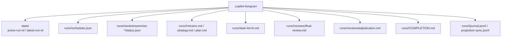

## 4.5 hook 侧车逻辑

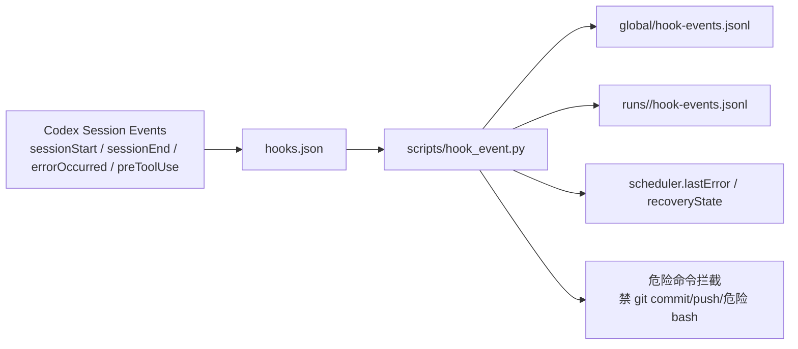

---

## 5. Skill 1：`ilongrun`

## 5.1 定位

`ilongrun` 是 **通用长跑入口**。它负责根据任务内容自动推断：

- `profile`：`coding / research / office`
- `mode`：`direct-lane / wave-swarm / super-swarm / fleet-governor / sentinel-watch`
- 初始 `phase / wave / workstream` 拓扑

## 5.2 运行架构图

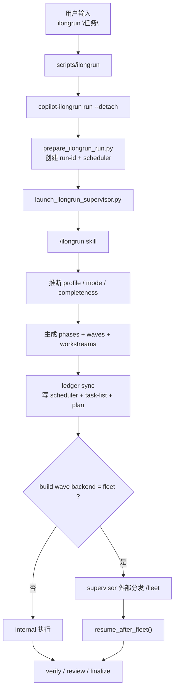

## 5.3 核心逻辑

1. **先建 run，再执行**：`prepare_ilongrun_run.py` 先初始化 `scheduler.json`。
2. **再让 skill 工作**：supervisor 把 canonical run 路径注入 skill 上下文。
3. **skill 先拆解，不急着执行**：尤其当 wave 标记成 `fleet` 时，主 pass 只做策略和合同拆解。
4. **执行完成后自动校验**：supervisor 会尝试 `dispatch_fleet_waves`、`maybe_run_final_audit`、`maybe_finalize_complete`。
5. **如果失败且可 fallback**：supervisor 会按模型链重试，并把原因回写到 scheduler。

## 5.4 `ilongrun` 内部的 profile 分叉图

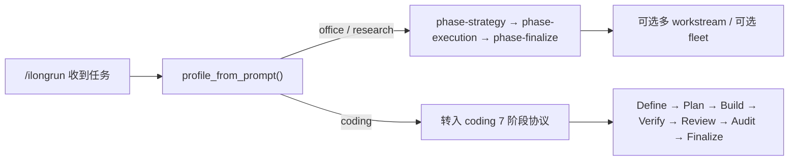

---

## 6. Skill 2：`ilongrun-coding`

## 6.1 定位

`ilongrun-coding` 不是单纯“换个 prompt”，而是把任务 **强制锁定到 coding profile**，并启用：

- workspace isolation
- task microcycle
- claim verification
- root cause before fix
- review / audit / finalize gate

## 6.2 关键事实

> 壳命令是 `ilongrun-coding`，但外层实际仍走 `/ilongrun`；`ilongrun-coding` 这个 skill 更像 **coding discipline kernel 协议入口**，在 `profile=coding` 时自动加载。

## 6.3 运行架构图

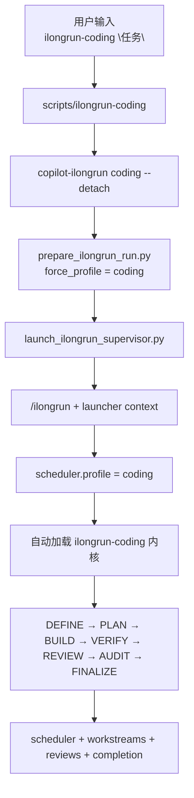

## 6.4 内核组成图

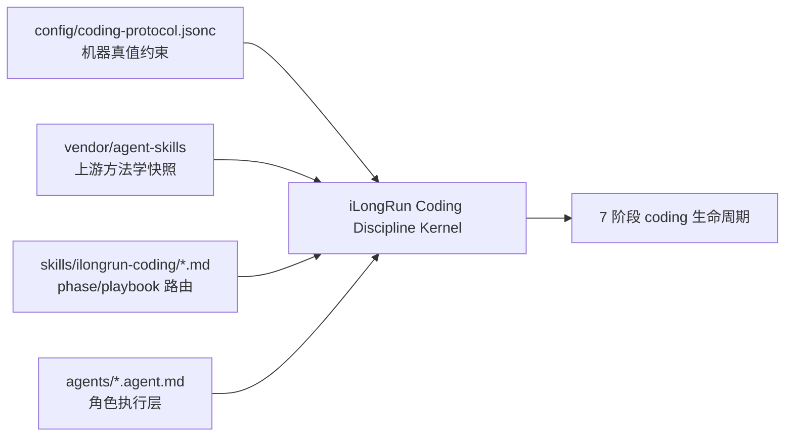

## 6.5 7 阶段逻辑图

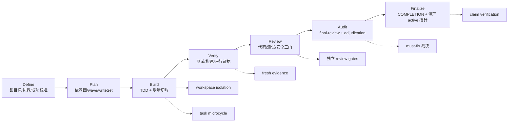

## 6.6 `ilongrun-coding` 内部 playbook 路由表

| Playbook | 作用阶段 | 主要职责 |
|---|---|---|
| `phase-define.md` | Define | 锁目标、边界、假设、技术画像 |
| `phase-plan.md` | Plan | 依赖图、wave、writeSet、handoff 合同 |
| `phase-build.md` | Build | TDD、增量实现、build 波次 |
| `phase-verify.md` | Verify | 测试/构建/运行证据，Stop-the-Line |
| `phase-review.md` | Review | `review-code` / `review-test-evidence` / `review-security` |
| `phase-audit.md` | Audit | 输出 `final-review.md` 与 `adjudication.md` |
| `phase-finalize.md` | Finalize | 输出 `COMPLETION.md`，收尾 |
| `swarm-policy.md` | Plan/Build | serial / swarm-wave / super-swarm 规则 |
| `workspace-isolation.md` | Build 前 | 决定 worktree / branch / in-place |
| `task-microcycle.md` | Build | `spec-lock → red → ... → handoff` |
| `claim-verification.md` | Verify/Finalize | 没有 fresh evidence 不能 claim done |
| `recovery-debug.md` | Blocked/Failed | 没有 root cause record 不要直接修 |

## 6.7 编码任务的角色协同图

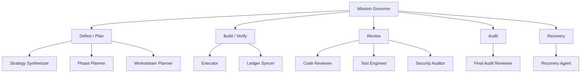

## 6.8 运行逻辑要点

1. `copilot-ilongrun coding` 会先把 `force_profile` 设为 `coding`。
2. `init_scheduler_payload()` 会一次性生成 coding 七阶段骨架。
3. `phase-build` 才可能使用 `fleet`，但必须满足：
   - writeSet 不重叠
   - handoffArtifacts 明确
   - 非 review / audit / finalize
4. `phase-review` 有三个硬 gate，不能被 final audit 替代。
5. `phase-audit` 负责生成：
   - `reviews/final-review.md`
   - `reviews/adjudication.md`
6. `phase-finalize` 只有在 claim verification、review、audit 都收敛后才能 complete。

---

## 7. Skill 3：`ilongrun-resume`

## 7.1 定位

`ilongrun-resume` 的设计目标不是“重跑一次”，而是：

- 不新建 run-id
- 读取旧真值
- 找出没收敛的 gate
- 只补最小闭环

## 7.2 运行架构图

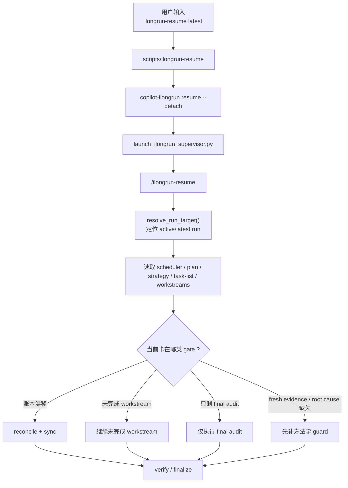

## 7.3 核心逻辑

1. **永远不 mint 新 run-id**。
2. 优先读：`scheduler.json` → `strategy.md` → `plan.md` → `task-list-N.md`。
3. 如果只是投影漂移，优先 reconcile，不重做执行任务。
4. 如果 supervisor context 指定“只做 pending final audit”，则只跑最终终审。
5. 如果缺的是 `freshEvidence / rootCauseRecord / reviewSequence`，先补这些 guard，再往后推进。

## 7.4 恢复决策图

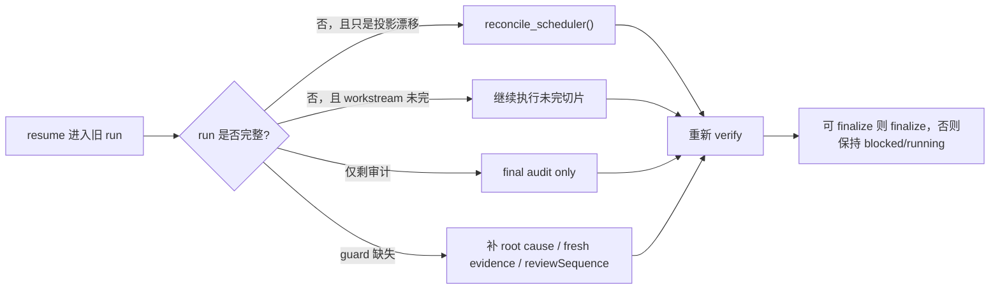

---

## 8. Skill 4：`ilongrun-prompt`

## 8.1 定位

`ilongrun-prompt` 用来 **先给你看策略骨架**，而不是立刻启动长跑。

它的输出重点是：

- 任务画像
- 推荐 mode
- phase / wave / workstream 数量建议
- 哪些适合 internal，哪些未来可尝试 `/fleet`
- coding 任务的最终终审提醒
- 推荐执行命令

## 8.2 运行架构图

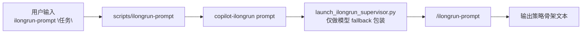

## 8.3 核心逻辑

1. 不创建 `.copilot-ilongrun/runs/<run-id>/`。
2. 不写 scheduler，不做 ledger sync。
3. 只做 **预规划输出**，相当于“开跑前的作战简报”。
4. 仍然可以走模型选择与 supervisor fallback，但没有 run 真值目录。

## 8.4 输出逻辑图

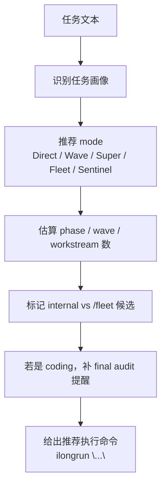

---

## 9. Skill 5：`ilongrun-status`

## 9.1 定位

`ilongrun-status` 是 **只读状态面板技能**，目标是把 run 的真实状态用中文看板方式展示出来。

## 9.2 关键事实

- 它不走 Copilot 技能正文。
- `copilot-ilongrun status` 在 very early path 就直接执行 `render_ilongrun_status_board.py`。
- 它会先 `reconcile_scheduler()`，再按真值渲染。

## 9.3 运行架构图

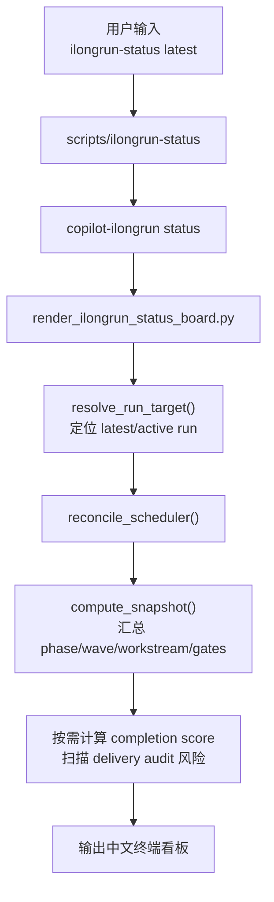

## 9.4 读取逻辑

它重点读取：

- `scheduler.json`
- `workstreams/*/status.json`
- `reviews/final-review.md`
- `reviews/adjudication.md`
- `COMPLETION.md`
- `journal.jsonl`
- `projection-sync.jsonl`

## 9.5 状态板判断图

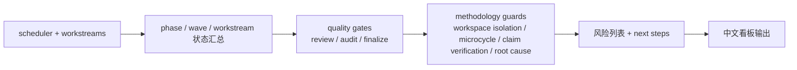

---

## 10. `ilongrun-coding` 的上游技能依赖关系

这里的 `vendor/agent-skills/skills/*` 更像 **方法学来源**，不是 iLongRun 运行期的直接命令入口。

## 10.1 依赖分层图

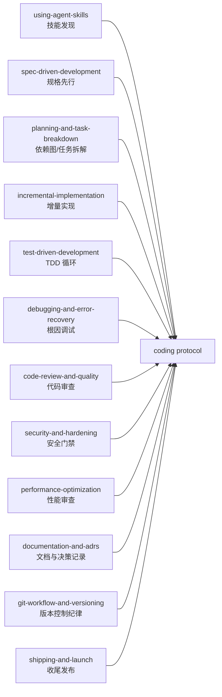

## 10.2 含义

- 这些 skill 并不是由 `copilot-ilongrun` 逐个调用。
- 它们被“编译”进了 `config/coding-protocol.jsonc` + `skills/ilongrun-coding/*` 的规则体系里。
- 所以它们更像 **编码内核的上游知识层**。

---

## 11. 你真正需要记住的 8 个关键点

1. **统一入口只有一个**：`scripts/copilot-ilongrun`。
2. **run/coding 先建账本，后执行**。
3. **状态真值只认 JSON，不认 Markdown 投影。**
4. **`ilongrun-coding` 是强制 coding profile，不只是换提示词。**
5. **`phase-build` 之外不能用 `fleet`。**
6. **`phase-review` 不能被 `phase-audit` 替代。**
7. **没有 fresh evidence，不允许 finalize complete。**
8. **`ilongrun-status` 是本地只读观察面，不是执行器。**

---

## 12. 源码定位索引

### 入口与控制

- `ilongrun-repo/scripts/copilot-ilongrun`
- `ilongrun-repo/scripts/ilongrun`
- `ilongrun-repo/scripts/ilongrun-coding`
- `ilongrun-repo/scripts/ilongrun-resume`
- `ilongrun-repo/scripts/ilongrun-prompt`
- `ilongrun-repo/scripts/ilongrun-status`

### 核心调度与账本

- `ilongrun-repo/scripts/prepare_ilongrun_run.py`
- `ilongrun-repo/scripts/launch_ilongrun_supervisor.py`
- `ilongrun-repo/scripts/reconcile_ilongrun_run.py`
- `ilongrun-repo/scripts/finalize_ilongrun_run.py`
- `ilongrun-repo/scripts/verify_ilongrun_run.py`
- `ilongrun-repo/scripts/sync_ilongrun_ledger.py`
- `ilongrun-repo/scripts/_ilongrun_lib.py`
- `ilongrun-repo/scripts/_ilongrun_shared.py`

### 状态与 hook

- `ilongrun-repo/scripts/render_ilongrun_status_board.py`
- `ilongrun-repo/scripts/render_ilongrun_launch_board.py`
- `ilongrun-repo/scripts/hook_event.py`
- `ilongrun-repo/hooks.json`

### 技能与协议

- `ilongrun-repo/skills/ilongrun/SKILL.md`
- `ilongrun-repo/skills/ilongrun-coding/SKILL.md`
- `ilongrun-repo/skills/ilongrun-resume/SKILL.md`
- `ilongrun-repo/skills/ilongrun-prompt/SKILL.md`
- `ilongrun-repo/skills/ilongrun-status/SKILL.md`
- `ilongrun-repo/config/coding-protocol.jsonc`
- `ilongrun-repo/config/model-policy.jsonc`

